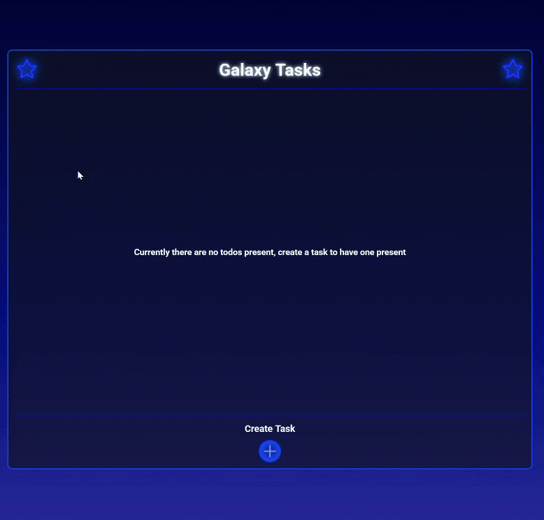

# Galaxy Tasks: CRUD Todo List

A space-themed task management application that implements full CRUD operations. It features a dynamic interface for creating, editing, and managing tasks, with data persistence handled via the browser's Local Storage.

## 🔗 Links

- **Live Demo Link:**

## 🚀 Todo List Showcase

## 🧐 About The Project

This project demonstrates proficiency in data handling and DOM manipulation. The core goal was to build a robust "Create, Read, Update, Delete" (CRUD) system without a backend database.

Instead, it utilizes the browser's **Local Storage API** to ensure that users' tasks remain saved even after refreshing the page or closing the browser. The UI is designed to be fluid, utilizing animations for adding and removing tasks to enhance the user experience.

### Key Features

- **Full CRUD Operations:**
  - **Create:** Users can add new tasks with a Title, Priority Level, and Status.
  - **Read:** The app checks Local Storage on load; if tasks exist, they are rendered. If not, a friendly "No tasks" message is displayed.
  - **Update:** Clicking the "Edit" pencil opens the modal pre-filled with the current task data, allowing for seamless modifications.
  - **Delete:** Tasks can be removed via the trash icon or by marking them as "Complete" (which triggers a fade-out animation).
- **Smart Form Reuse:**
  - To keep the code DRY (Don't Repeat Yourself), the "Add" and "Edit" functions share the same HTML form structure.
  - The JavaScript logic dynamically swaps the submit button's functionality and ID depending on whether the user is creating a new item or updating an existing one.
- **Persistent State:** All changes are immediately synced to `localStorage`, ensuring data integrity across sessions.

## 🛠️ Technologies Used

- **Semantic HTML5** for the application structure.
- **CSS3** for the "Galaxy" theme, utilizing background images, neon glow effects, and keyframe animations for the modal and task transitions.
- **JavaScript(ES6+)** for:
  - Event Delegation (handling clicks on dynamic task lists).
  - `JSON.parse()` and `JSON.stringify()` for local storage management.
  - DOM manipulation for rendering task cards.
